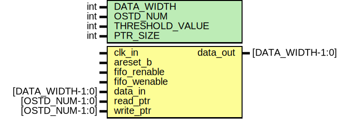

# Entity: memory_array 
- **File**: memory_array.sv

## Diagram

## Generics

| Generic name    | Type | Value                                 | Description                                              |
| :-------------: | :--: | :-----------------------------------: | :------------------------------------------------------: |
| DATA_WIDTH      | int  | 32                                    | Transaction data width                                   |
| OSTD_NUM        | int  | 8                                     | Number of outstanding transactions                       |
| THRESHOLD_VALUE | int  | OSTD_NUM/2                            | Minimum number of expected values in FIFO                |
| PTR_SIZE        | int  | (OSTD_NUM > 1) ? $clog2(OSTD_NUM) : 1 | Set pointer size to be 2^N = OSTD_NUM - Unused parameter |

## Ports

| Port name    | Direction | Type             | Description                    |
| :----------: | :-------: | :--------------: | :----------------------------: |
| clk_in       | input     |        -         | Clock source                   |
| areset_b     | input     |        -         | Reset source - Active low      |
| fifo_renable | input     |        -         | FIFO read enable               |
| fifo_wenable | input     |        -         | FIFO write enable              |
| data_in      | input     | [DATA_WIDTH-1:0] | Transaction data input (Write) |
| read_ptr     | input     | [OSTD_NUM-1:0]   | Read pointer                   |
| write_ptr    | input     | [OSTD_NUM-1:0]   | Write pointer                  |
| data_out     | output    | [DATA_WIDTH-1:0] | Transaction data output (Read) |

## Signals

| Name                    | Type                 | Description  |
| :---------------------: | :------------------: | :----------: |
| data_reg [OSTD_NUM-1:0] | reg [DATA_WIDTH-1:0] | Memory array |

## Processes
- mem_array_storage: ( @(posedge clk_in or negedge areset_b) )
  - **Type:** always
