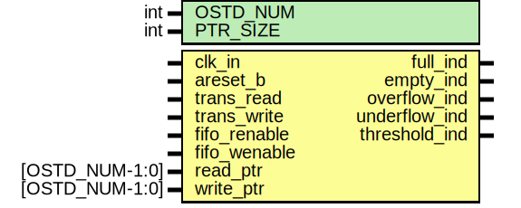

# Entity: monitor_signal 
- **File**: monitor_signal.sv
- **Title:**  Monitor Signal

## Diagram

## Description

## Generics

| Generic name | Type | Value                                 | Description                                              |
| :----------: | :--: | :-----------------------------------: | :------------------------------------------------------: |
| OSTD_NUM     | int  | 8                                     | Number of outstanding transactions                       |
| PTR_SIZE     | int  | (OSTD_NUM > 1) ? $clog2(OSTD_NUM) : 1 | Set pointer size to be 2^N = OSTD_NUM - Unused parameter |

## Ports

| Port name     | Direction | Type           | Description                    |
| :-----------: | :-------: | :------------: | :----------------------------: |
| clk_in        | input     |       -        | Clock source                   |
| areset_b      | input     |       -        | Reset source - Active low      |
| trans_read    | input     |       -        | Transaction-side read enable   |
| trans_write   | input     |       -        | Transaction-side write enable  |
| fifo_renable  | input     |       -        | FIFO read enable               |
| fifo_wenable  | input     |       -        | FIFO write enable              |
| read_ptr      | input     | [OSTD_NUM-1:0] | Read pointer                   |
| write_ptr     | input     | [OSTD_NUM-1:0] | Write pointer                  |
| full_ind      | output    |       -        | FIFO full indicator            |
| empty_ind     | output    |       -        | FIFO empty indicator           |
| overflow_ind  | output    |       -        | FIFO overflow indicator        |
| underflow_ind | output    |       -        | FIFO underflow indicator       |
| threshold_ind | output    |       -        | FIFO threshold value indicator |

## Signals

| Name            | Type                | Description                                 |
| :-------------: | :-----------------: | :-----------------------------------------: |
| ptr_msb_compare | wire                | Read & Write pointer MSB value comparison   |
| overflow_set    | wire                | Overflow detector                           |
| underflow_set   | wire                | Underflow detector                          |
| ptr_equal       | wire                | Read & Write pointer values equal indicator |
| ptr_result      | wire [OSTD_NUM-1:0] |                                             |

## Processes
- indicator_update: (  )
  - **Type:** always_comb
  - **Description**
  Update indicators based on the set conditions
 
- underflow_indicator: ( @(posedge clk_in or negedge areset_b) )
  - **Type:** always
  - **Description**
  Update underflow_ind if FIFO is empty and nothing is being written in
 
- overflow_indicator: ( @(posedge clk_in or negedge areset_b) )
  - **Type:** always
  - **Description**
  Update overflow_ind if FIFO is full and data is still being written in
 
