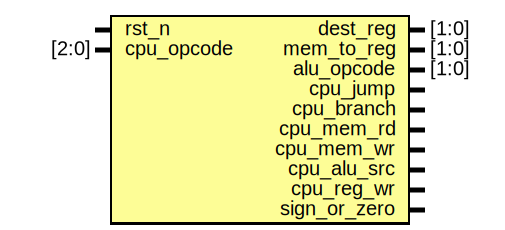

# Entity: cpu_control_unit 
- **File**: cpu_control_unit.sv

## Diagram

## Ports

| Port name    | Direction | Type  | Description                      |
| ------------ | --------- | ----- | -------------------------------- |
| rst_n        | input     |       | Reset input - Active low         |
| cpu_opcode   | input     | [2:0] | CPU opcode input                 |
| dest_reg     | output    | [1:0] | Multiplexer destination register |
| mem_to_reg   | output    | [1:0] | Memory to register logic         |
| alu_opcode   | output    | [1:0] | Arithmetic logic unit opcode     |
| cpu_jump     | output    |       | CPU Jump indicator               |
| cpu_branch   | output    |       | CPU Branch indicator             |
| cpu_mem_rd   | output    |       | CPU Read from Memory indicator   |
| cpu_mem_wr   | output    |       | CPU Write to Memory indicator    |
| cpu_alu_src  | output    |       | CPU Source from ALU indicator    |
| cpu_reg_wr   | output    |       | CPU Write to Register indicator  |
| sign_or_zero | output    |       | Signed or Zero indicator         |

## Processes
- cpu_ctrl_operation: (  )
  - **Type:** always_comb
