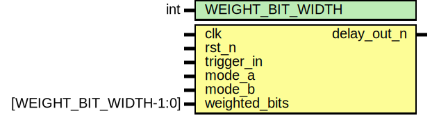

# Entity: delay_timer 
- **File**: delay_timer.sv
- **Title:**  Programmable Digital Delay Timer

## Diagram

## Description

## Generics

| Generic name     | Type | Value | Description                 |
| :--------------: | :--: | :---: | :-------------------------: |
| WEIGHT_BIT_WIDTH | int  | 8     | Defines weighted_bits width |

## Ports

| Port name     | Direction | Type                   | Description                                      |
| :-----------: | :-------: | :--------------------: | :----------------------------------------------: |
| clk           | input     |           -            | Clock source                                     |
| rst_n         | input     |           -            | Reset source - Active low                        |
| trigger_in    | input     |           -            | Delay trigger input                              |
| mode_a        | input     |           -            | Controls delay_mode bit 0                        |
| mode_b        | input     |           -            | Controls delay_mode bit 1                        |
| weighted_bits | input     | [WEIGHT_BIT_WIDTH-1:0] | Programs delay based on equation (Refer to spec) |
| delay_out_n   | output    |           -            | Outputs amount of delay provided                 |

## Signals

| Name           | Type                       | Description                                                                             |
| :------------: | :------------------------: | :-------------------------------------------------------------------------------------: |
| pulse_width    | reg [WEIGHT_BIT_WIDTH-1:0] | Pulse width counter                                                                     |
| delay          | reg [WEIGHT_BIT_WIDTH-1:0] | Delay counter                                                                           |
| timer          | reg [WEIGHT_BIT_WIDTH-1:0] | Timer counter                                                                           |
| delay_mode     | reg [1:0]                  | Delay mode - 00 = One-shot, 01 - Delayed Operate, 10 - Delayed Release, 11 - Dual Delay |
| trigger_d1     | reg                        | Delay trigger input - Delayed by 1 clock cycle                                          |
| trigger_d2     | reg                        | Delay trigger input - Delayed by 2 clock cycle                                          |
| timer_start    | reg                        | Start timer indicator                                                                   |
| output_en_n    | reg                        | Output enable indicator - Active low                                                    |
| reset_timer_d0 | reg                        | Reset timer - Delayed by 0 clock cycle                                                  |
| reset_timer_d1 | reg                        | Reset timer - Delayed by 1 clock cycle                                                  |
| reset_timer_d2 | reg                        | Reset timer - Delayed by 2 clock cycle                                                  |
| reset_d1       | reg                        | Reset input - Delayed by 1 clock cycle                                                  |
| reset_d2       | reg                        | Reset input - Delayed by 2 clock cycle                                                  |
| trigger_rise   | wire                       | Trigger input rise indicator                                                            |
| trigger_fall   | wire                       | Trigger input fall indicator                                                            |
| reset_timer_d3 | wire                       | Reset timer - Delayed by 3 clock cycle                                                  |
| reset_d0       | wire                       | Reset input - Delayed by 0 clock cycle                                                  |
| timer_clr_lvl0 | wire                       | Timer clear - Level 0                                                                   |
| timer_clr_lvl2 | wire                       | Timer clear - Level 2                                                                   |
| timer_clr_lvl3 | wire                       | Timer clear - Level 3                                                                   |

## Processes
- delay_cycle: ( @(posedge clk or negedge rst_n) )
  - **Type:** always
  - **Description**
  Shift in data and delay for 1 clock cycle
 
- trigger_effect: ( @(trigger_rise, trigger_fall, mode_a, mode_b, weighted_bits) )
  - **Type:** always
  - **Description**
  Sample mode & weighted bits
 
- delay_behav: ( @(delay_mode, rst_n, trigger_rise, trigger_fall, timer, trigger_in, pulse_width, delay, reset_d0) )
  - **Type:** always
  - **Description**
  Delay modes
 
- timer_behav: ( @(posedge clk or posedge timer_clr_lvl0) )
  - **Type:** always
  - **Description**
  Timer
 
- delayed_output: ( @(posedge clk or negedge rst_n) )
  - **Type:** always
  - **Description**
  Delay output
 
